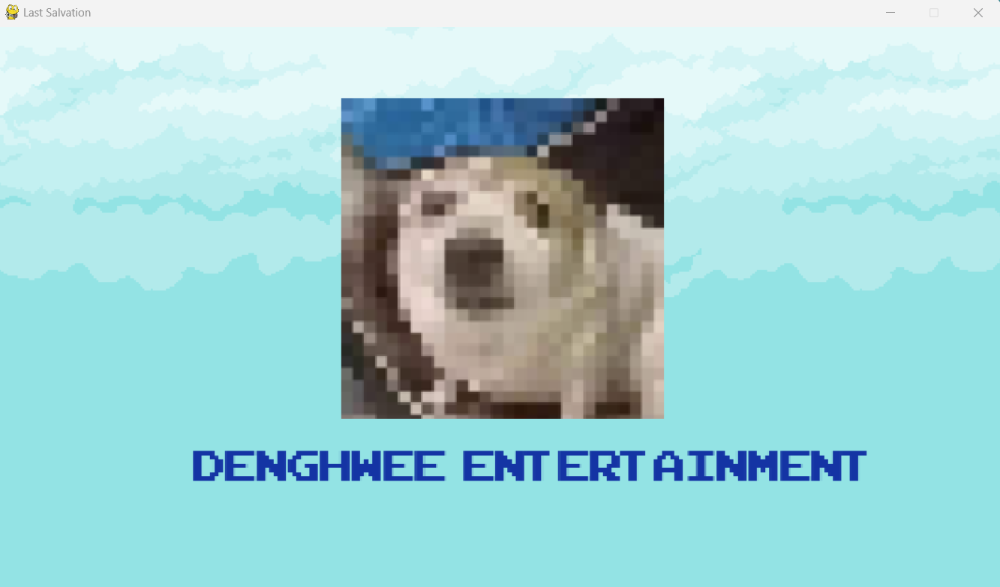
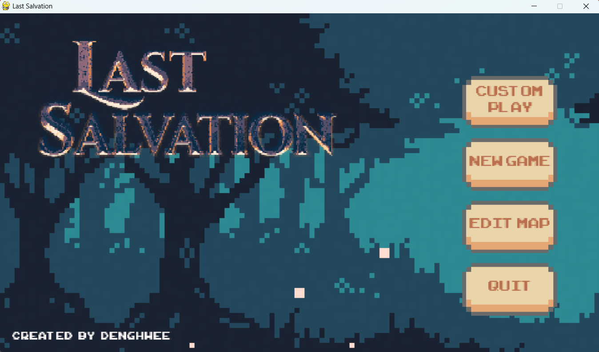
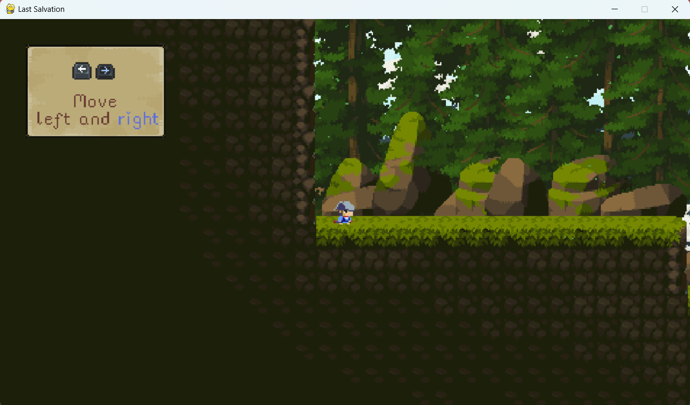
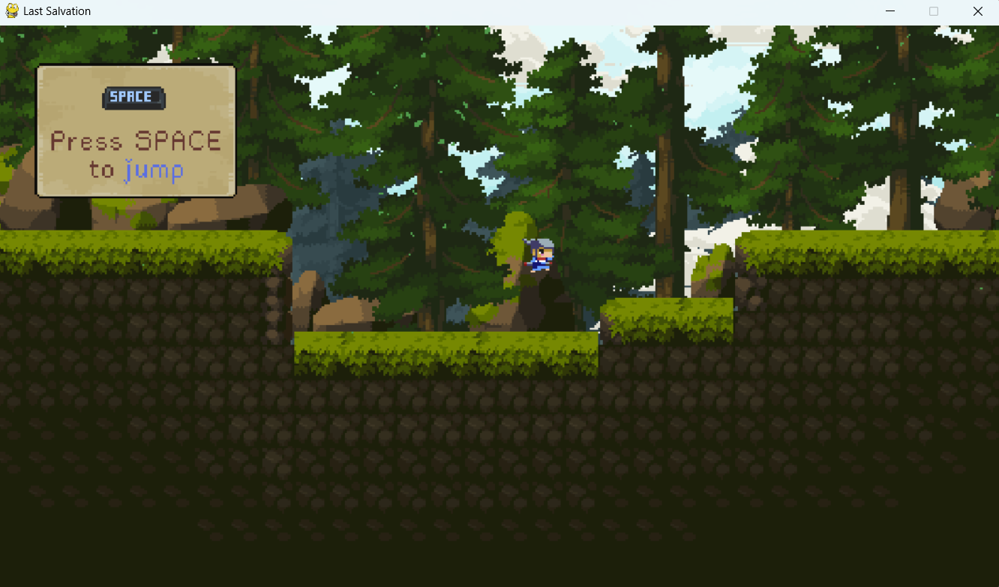
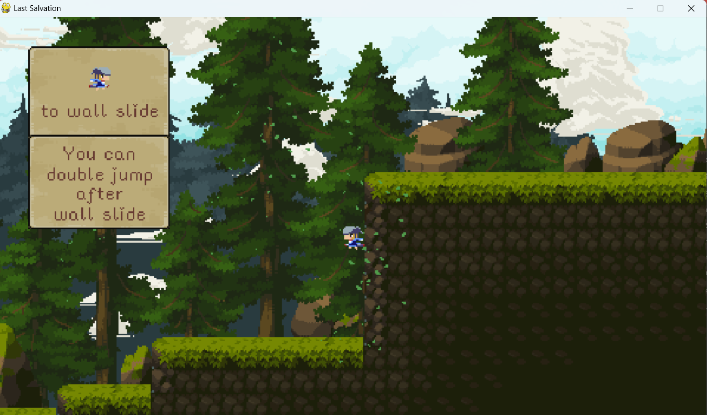
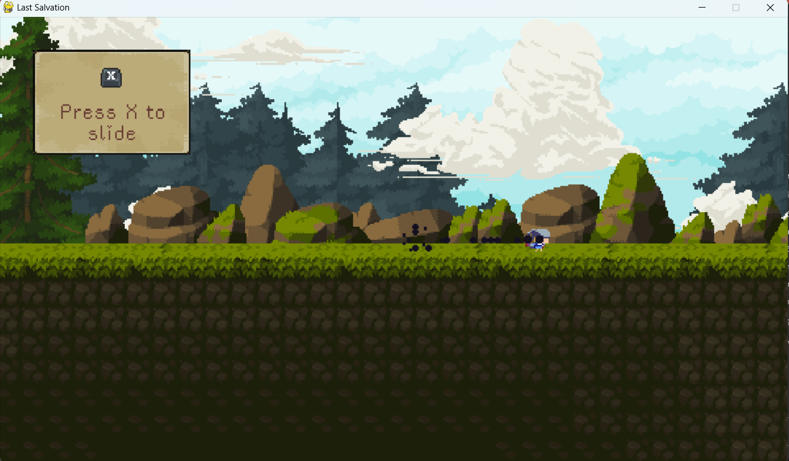
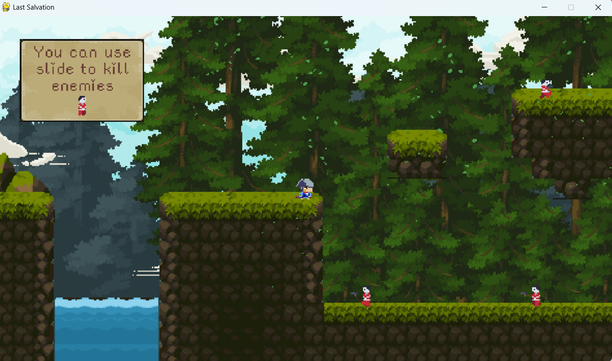
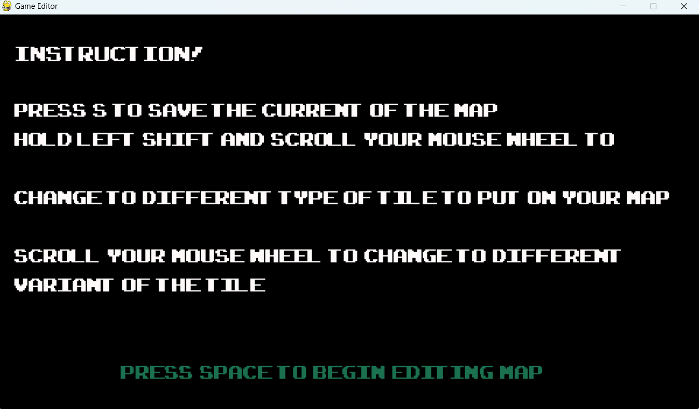
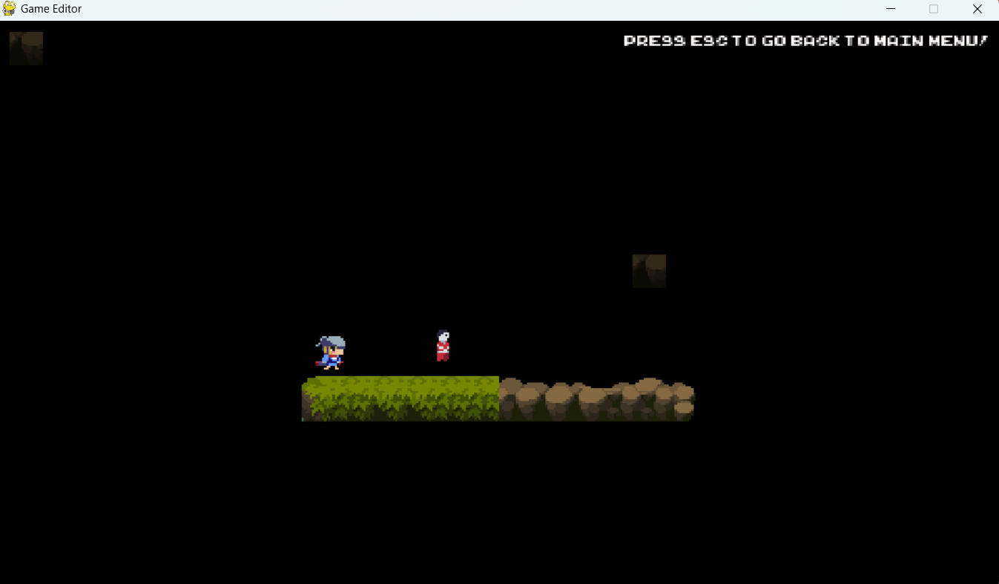

# Last Salvation - Trò chơi Platformer phát triển bằng Pygame

## 1. Giới thiệu  
**Last Salvation** là một dự án game thuộc thể loại **Platformer** phát triển bằng framework **Pygame**. Trò chơi dựa vào các yếu tố từ các tựa game như:  
- **Super Mario Series** – Cách chơi đơn giản, dễ tiếp cận.  
- **Celeste** – Thiết kế màn chơi có chiều sâu và yếu tố khám phá.  
- **Hollow Knight** – Cơ chế điều khiển nhân vật linh hoạt với các kỹ năng như lướt, trượt tường,...

Mục tiêu của trò chơi là người chơi trải nghiệm một hành trình đầy thử thách, đòi hỏi kỹ năng điều khiển tốt để vượt qua các chướng ngại vật và kẻ thù trong game.  

Tất cả file gốc của dự án sẽ ở trong thư mục ***Orginal source code***.

Original source code/
├── Data/
│   ├── Font/
│   ├── Images/
│   ├── Maps/
│   ├── SFX/
│   │   ├── Icon.ico
│   │   ├── Icon.png
├── Scripts/
│   ├── __pycache__/
│   ├── BackgroundEntities.py
│   ├── DevUtils.py
│   ├── Entities.py
│   ├── Particle.py
│   ├── Spark.py
│   ├── Tilemap.py
│   ├── Cutscene.py
│   ├── Editor.py
│   ├── Game.py
│   ├── Menu.py
│   ├── Menu.spec
│   ├── PausedGame.py

---

## 2. Lối chơi  
- Khi khởi động trò chơi và chọn **New Game**, màn chơi đầu tiên sẽ bắt đầu.

- Người chơi được hướng dẫn thông qua các hình ảnh trực quan để làm quen với cơ chế điều khiển.  
- **Mục tiêu chính:**  
  - Điều khiển nhân vật vượt qua các chướng ngại vật, sử dụng các kỹ năng như leo trèo, trượt tường, lướt,...  
  - Tiêu diệt kẻ thù để mở đường sang màn tiếp theo.  
- **Kẻ thù:**  
  - **Samurai màu đỏ** – Kẻ địch có khả năng tấn công từ xa, yêu cầu người chơi phải có chiến thuật hợp lý để né tránh và phản công.  
- **Độ khó & Thử thách:**  
  - Trò chơi không có **checkpoint**, mỗi lần nhân vật bị hạ gục, màn chơi sẽ được khởi động lại từ đầu.  
  - Phong cách thiết kế mang hơi hướng **"Souls-like"**, tạo độ khó cao, yêu cầu người chơi phải thành thạo kỹ năng điều khiển để tiến xa hơn.
 

)

---

## 3. Chế độ sáng tạo màn chơi  
Ngoài chế độ chơi thông thường, **Last Salvation** cung cấp một hệ thống **tạo màn chơi** cho phép người chơi tự thiết kế và trải nghiệm các bản đồ do chính mình tạo ra.  
- Chế độ này giúp nâng cao khả năng chơi lại của trò chơi.  
- Người chơi có thể tùy chỉnh bản đồ theo sở thích, tạo ra các thử thách cá nhân.  
- Mô tả hướng dẫn chi tiết được tích hợp để hỗ trợ người chơi làm quen với công cụ chỉnh sửa màn chơi.  

---

## 4. Các tính năng chính  
- **Cơ chế điều khiển đa dạng**, cho phép nhân vật thực hiện các hành động như nhảy, leo trèo, trượt tường, lướt,...  
- **Hệ thống tạm dừng trò chơi**.  
- **Bật/tắt nhạc nền và hiệu ứng âm thanh**.  
- **Hiệu ứng đồ họa động** (hiệu ứng lướt, đạn, nhân vật bị hạ gục, lá rơi, mây di chuyển,...)  
- **Mô phỏng chuyển động nền (background animation)** giúp tạo chiều sâu cho môi trường game.  
- **Hệ thống hướng dẫn chi tiết** dành cho người chơi mới.  
- **Hệ thống chuyển cảnh và cắt cảnh** giúp nâng cao trải nghiệm cốt truyện.  
- **Hệ thống vật lý và va chạm chính xác**.  
- **Công cụ hỗ trợ dành cho Developer** để mở rộng và phát triển game.

## 4. Link báo cáo: [Link](https://drive.google.com/file/d/1SPpj7PWvNvrU7vq_UaGvfk1h4OF5aNte/view?usp=sharing)
